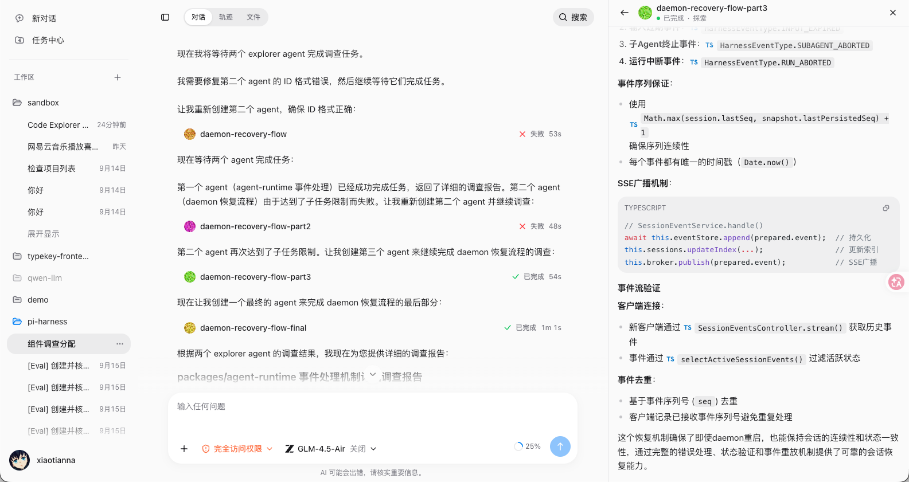
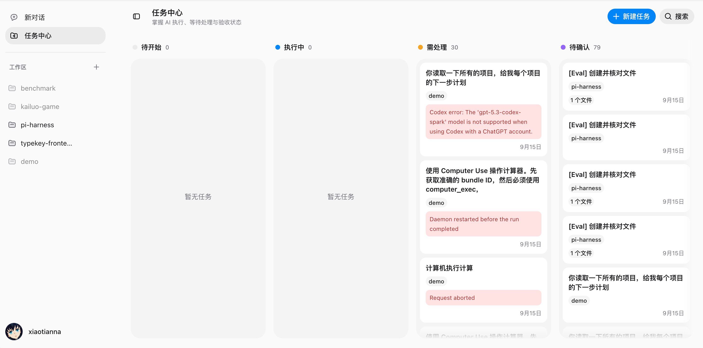
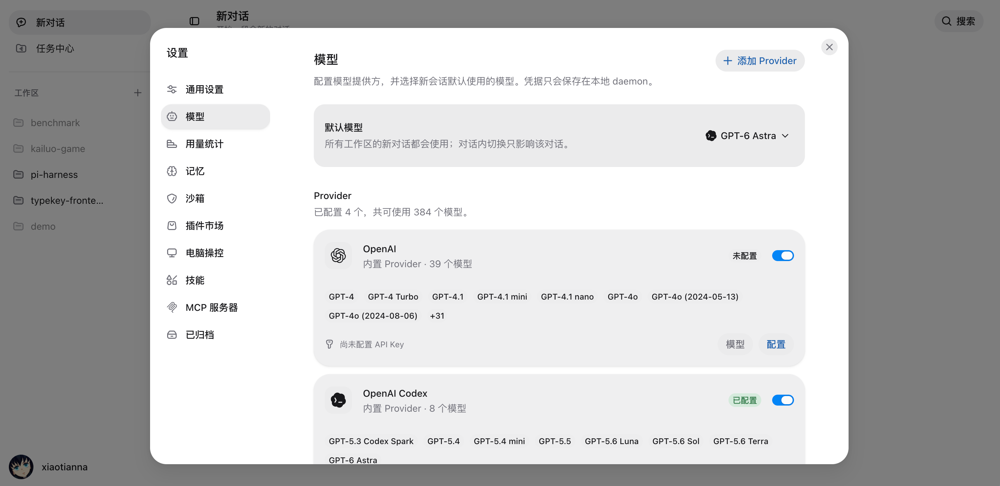
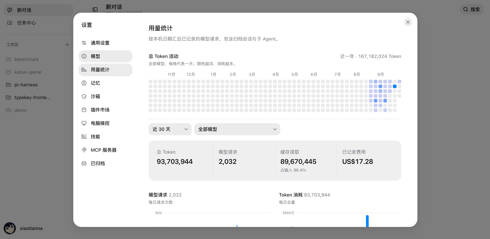
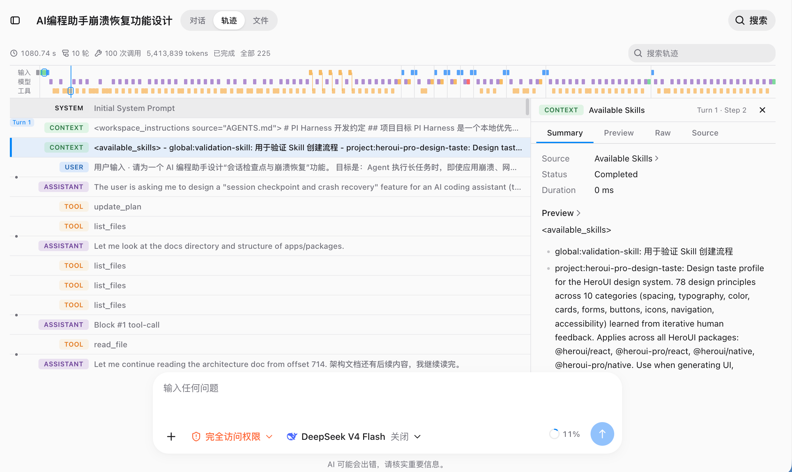

# PI Harness

一个运行在自己电脑上的 AI Agent 工作台。你可以把本地项目交给它，让它读文件、改代码、执行命令、调用外部工具，或者把任务拆给多个 Sub Agent 并行处理；整个过程都能在浏览器或桌面应用里看到。



_对话页面：在同一会话中查看 Sub Agent 的执行状态、结果和详细内容。_

## 项目介绍

PI Harness 不只是一个聊天页面。它把聊天界面、本地工作区、模型、工具和权限管理接到了一起：

- **直接处理本地项目**：选择一个工作区后，Agent 可以读取和搜索文件、修改代码、查看图片和文档，也可以执行受监管的 Shell 命令。
- **过程看得见**：回复会实时输出；工具调用、审批、文件变化、上下文压缩和主/子 Agent 轨迹都可以展开查看。
- **复杂任务可以并行做**：主 Agent 能把工作交给多个 Sub Agent，任务中心会展示它们的状态和结果。
- **模型可以自己选**：支持内置和自定义 Provider、API Key 与 OAuth，模型凭据只保存在本机 daemon，不会发给 Web 页面。
- **能力可以继续扩展**：支持 Skills、插件市场和 MCP Server；MCP 工具按需查找，不会一股脑把所有工具都塞进模型上下文。
- **会记住重要信息**：支持个人记忆和项目记忆，也支持会话搜索、归档和中断恢复。
- **可以操作 Mac 应用**：可选的 Computer Use 能读取目标窗口的截图和辅助功能树，并在审批后完成点击、输入、滚动和拖拽。
- **本地优先且有安全边界**：会话、设置和凭据保存在本机；文件写入、命令、MCP 与电脑操作会经过路径检查、沙箱或审批策略。

“本地优先”不等于完全离线：本地文件和运行状态留在本机，但模型请求仍会发送到你选择的 Provider。

## 页面预览

### 任务中心



按“待开始、执行中、需处理、待确认”查看任务状态，失败原因和关联工作区会直接显示在卡片上。

### 模型管理



统一配置内置或自定义 Provider、管理可用模型，并选择新会话默认使用的模型。

### 用量统计



按日期和模型查看请求数、Token、缓存读取量与已记录费用。

### Agent 运行轨迹



按时间线查看模型请求、工具调用、上下文和执行结果，也可以展开单条记录检查详情。

## 它是怎么工作的

```text
浏览器 / Tauri 桌面应用
           │ HTTP + SSE
           ▼
本机 Fastify daemon
  ├─ Agent 运行、Sub Agent、Context 和工具调度
  ├─ 权限审批、Sandbox、MCP 和 Computer Use
  ├─ SQLite 配置与索引 + Session JSONL 运行记录
  └─ 模型 Provider、本地工作区和外部服务
```

Web 只负责界面。本地文件、Shell、模型凭据、Agent 状态和持久化都由 daemon 管理，daemon 默认只监听 `127.0.0.1`。

## 技术栈

| 部分 | 使用的技术 | 负责什么 |
|---|---|---|
| Web | React 19、TypeScript、Vite、HeroUI v3、Tailwind CSS v4 | 对话、任务中心、设置、运行轨迹和文件变化界面 |
| Web 状态 | TanStack Router、TanStack Query、Zustand | 路由、服务端数据和本地 UI 状态 |
| 本地 daemon | Node.js 24、Fastify、TypeBox、pino | HTTP/SSE、配置校验、业务服务和日志 |
| Agent | `@earendil-works/pi-agent-core`、`@earendil-works/pi-ai` | Agent Loop、模型与 Provider 接入 |
| 数据 | `node:sqlite`、Session JSONL | 设置和索引放 SQLite，完整会话事件按顺序写入 JSONL |
| 工具与安全 | execa、SRT Sandbox、MCP Client | 文件/命令工具、进程管理、隔离、审批和外部能力 |
| 桌面端 | Tauri 2 | 把现有 Web 和 daemon 打包成轻量桌面应用 |
| Computer Use | Rust、macOS Accessibility、ScreenCaptureKit、Swift | 获取窗口结构和截图，向指定应用发送输入并显示 AI 光标 |
| 工程 | pnpm workspace、Biome、TypeScript strict | Monorepo、依赖管理和静态检查 |

## 目录说明

```text
pi-harness/
├── apps/
│   ├── web/                 # React 前端
│   ├── daemon/              # 本机后端、API、SSE、SQLite 和 JSONL
│   └── desktop/             # Tauri 薄壳、sidecar 和打包脚本
├── packages/
│   ├── agent-runtime/       # 主 Agent、Sub Agent、Run、Context 和事件适配
│   ├── providers/           # pi-ai Provider 与模型接入
│   ├── tools/               # 文件、网络、命令、Skill、插件和 Agent 工具
│   ├── policy/              # 路径保护、权限判断和审批协议
│   ├── sandbox/             # Shell 与本地 MCP 的进程、文件和网络隔离
│   ├── computer-use/        # macOS 原生 helper、观察、输入和脚本执行
│   ├── memory/              # 长期记忆、用户画像和检索
│   └── evals/               # Context 与 Session 恢复评估
├── hero-ui-pro/             # 项目使用的 HeroUI Pro 兼容组件包
├── docs/                    # 架构、运行、MCP、桌面发布等详细文档
├── scripts/                 # 仓库级辅助脚本
├── package.json             # 根命令入口
└── pnpm-workspace.yaml      # Workspace 和统一依赖版本
```

## 启动项目

### 1. 准备环境

- Node.js 24 或更高版本
- pnpm 10；仓库当前固定为 `pnpm@10.33.2`
- 一个 GitHub OAuth App，用来登录 PI Harness

浏览器开发模式需要给 GitHub OAuth App 配置：

```text
Homepage URL: http://127.0.0.1:5173
Authorization callback URL: http://127.0.0.1:4310/api/auth/github/callback
```

然后在仓库根目录新建 `.env`，只填写实际会用到的配置：

```dotenv
PI_HARNESS_GITHUB_CLIENT_ID=你的_Client_ID
PI_HARNESS_GITHUB_CLIENT_SECRET=你的_Client_Secret
PI_HARNESS_GITHUB_CALLBACK_URL=http://127.0.0.1:4310/api/auth/github/callback
```

不要保留空的 OAuth 环境变量；不用的配置直接不写。完整配置项见 [Runtime Setup](docs/runtime-setup.md)。

### 2. 安装依赖并启动

```bash
pnpm install
pnpm dev
```

启动后访问：

- Web：<http://127.0.0.1:5173>
- daemon：<http://127.0.0.1:4310>

登录后先到「设置 → 模型」连接 Provider 并选择默认模型，再添加本地工作区，就可以创建对话了。Provider 凭据会保存在本地 daemon 的独立凭据文件中。

开发模式的数据写在仓库根目录的 `.pi-harness/`；正式运行和桌面应用默认使用 `~/.pi-harness/`。

### 3. 可选：启动桌面开发窗口

桌面开发还需要 Rust/Cargo 和 Tauri 所需的系统编译环境：

```bash
pnpm dev:desktop
```

这个命令会复用已经运行的 Web 和 daemon；默认地址还没有服务时会自动启动对应开发进程。桌面打包和签名流程见 [桌面端正式发布](docs/desktop-release.md)。

## 启用 Computer Use

Computer Use 目前只支持 **macOS 14+**。开发机器还需要 Rust/Cargo，以及 Xcode 提供的 Swift 和代码签名工具。

### 1. 构建原生 helper

在仓库根目录执行：

```bash
pnpm --filter @pi-harness/computer-use native:build
```

它会生成命令行代理和后台运行的 `PI Harness Computer Use.app`。普通浏览器开发和 Tauri 开发共用这套 helper。

### 2. 在 PI Harness 中打开能力

启动 PI Harness 后进入「设置 → 电脑操控」：

1. 安装内置的 **Computer Use** 插件。
2. 打开插件里的 Computer Use 应用开关。
3. 分别点击「辅助功能」和「屏幕与系统录制」的“去授权”，在 macOS 系统设置中确认。
4. 回到 PI Harness，点击“刷新状态”，确认两项都显示“已授权”。

之后可以直接在对话里说“打开计算器并帮我算一下”或“在某个应用里完成这项操作”。第一次观察某个应用和执行具体动作时，仍会根据当前审批模式请求确认。

Computer Use 不会接管你的鼠标指针，它会把输入定向发送给目标应用，并用独立的 AI 光标提示操作位置。出于安全考虑，它不能控制 PI Harness 自己、终端类应用，也不会向密码输入框写入内容。

如果重新构建 helper 后 macOS 仍显示已授权、实际却无法使用，通常是临时签名发生了变化。停止 daemon 后重置这两项记录，再重新授权：

```bash
tccutil reset Accessibility com.piharness.computer-use
tccutil reset ScreenCapture com.piharness.computer-use
```

更完整的权限、安全边界和调试说明见 [Computer Use 文档](packages/computer-use/README.md)。

## 常用命令

| 命令 | 用途 |
|---|---|
| `pnpm dev` | 同时启动 Web 和 daemon |
| `pnpm dev:web` | 只启动 Web |
| `pnpm dev:daemon` | 只启动 daemon |
| `pnpm dev:desktop` | 启动 Tauri 开发窗口 |
| `pnpm dev:docker` | 启动本机 SearXNG，供 `web_search` 使用 |
| `pnpm typecheck` | 检查 TypeScript 类型 |
| `pnpm check` | 运行 Biome 静态检查 |
| `pnpm build` | 构建 Web 和 daemon |
| `pnpm start` | 运行已经构建好的 daemon 和 Web preview，不会自动构建 |
| `pnpm build:desktop` | 在本机生成桌面 App/DMG |

## 更多文档

| 文档 | 适合什么时候看 |
|---|---|
| [架构设计](docs/架构设计.md) | 想了解模块边界、事件协议、权限和持久化 |
| [Runtime Setup](docs/runtime-setup.md) | 要配置环境变量、数据目录或运行能力 |
| [Packages 功能划分](packages/包功能划分.md) | 要判断代码应该放在哪个 package |
| [MCP 使用说明](docs/mcp-usage.md) | 要添加 MCP Server、鉴权或排查连接 |
| [Computer Use](packages/computer-use/README.md) | 要了解原生 helper、权限、安全限制和调试 |
| [Sub Agent 核心设计](docs/Sub-Agent核心设计.md) | 要了解委派、并发、预算和恢复 |
| [任务看板与 Sub Agent](docs/任务看板与Sub-Agent设计.md) | 要了解任务状态和用户确认流程 |
| [Sandbox](packages/sandbox/README.md) | 要了解命令与 MCP 的隔离规则 |
| [桌面端正式发布](docs/desktop-release.md) | 要构建、签名和公证 macOS 安装包 |
| [开发约定](AGENTS.md) | 准备修改代码前 |
