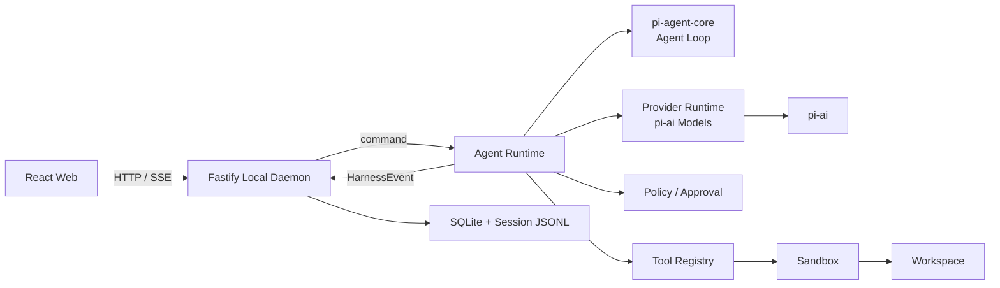

# PI Harness 架构设计

## 1. 目标

PI Harness 是本地优先的 Agent Harness：浏览器提供 Codex 风格界面，本地 daemon 负责模型调用、Agent 运行、工具执行、安全审批和持久化。

底层只复用：

- `@earendil-works/pi-agent-core` 的 `Agent` 与 Agent Loop。
- `@earendil-works/pi-ai` 的模型、Provider、流式调用与认证能力。

Session、事件协议、工具、Skill、权限、Sandbox、记忆、上下文管理、Planner、持久化和观测由项目自己实现。不使用 Pi 内置 `AgentHarness`、Coding Agent Session、工具、Session Storage 或完整 Harness。

### 能力范围

| 能力 | 所属模块 | 关键约束 |
|---|---|---|
| Provider / Model | `providers` + daemon provider service | 复用 `pi-ai Models`，内置按需注册，自定义配置可持久化 |
| Tool/Skill Registry | `tools/tools` / `tools/skills` | 稳定 ID、schema、版本和来源校验 |
| Tool/Skill RAG 选择 | Tool Selector / Skill Selector | 只缩小候选集，不授权 |
| Tool 并发、超时与去重 | Tool Execution Guard | 只读可并行，写入/Shell 串行 |
| Sandbox | `sandbox` | workspace、进程、资源和网络边界 |
| Memory / RAG | daemon memory，后续可提取 `retrieval` | 记忆可审计，索引可重建 |
| Context 压缩 | `agent-runtime/context` | 不覆盖原始 JSONL |
| Planner / Todos | `tools/tools/planner.ts` / `todos.ts` | 作为控制工具维护规划与执行状态 |
| Policy | `policy` | 统一 `allow / ask / deny` |
| Human-in-the-loop | daemon + runtime + policy | 可持久化、可超时、可恢复 |
| Trace | daemon observability | 关联 run/model/tool/retrieval/HITL，写入前脱敏 |

## 2. 总体架构



项目是 pnpm workspace 管理的 TypeScript Monorepo，运行时仍是模块化单体：只有一个 daemon 进程，不拆微服务。

### 边界

- Web 只负责交互，不持有凭据，不访问本地文件，不导入 Pi、daemon storage 或 tools。
- daemon 是组装根，负责 HTTP/SSE、业务服务、持久化和运行时组装。
- `agent-runtime` 只编排 Agent，不直接实现 SQL、HTTP、SSE 或文件工具。
- Pi 原始事件只能在 `agent-runtime` 内出现，对外必须转换为 `HarnessEvent`。
- Policy 决定“能否执行”，Sandbox 限制“最多能影响什么”，两者不合并。

## 3. 目录与包职责

```text
apps/
├── daemon/
│   └── src/
│       ├── config/
│       ├── routes/              # 路径与 schema
│       ├── controllers/         # HTTP 映射
│       ├── dto/
│       ├── vo/
│       ├── services/            # session/provider/workspace/HITL 流程
│       ├── storage/             # SQLite migration/repository + JSONL
│       ├── sse/                 # 订阅、重连、广播
│       ├── memory/              # 出现真实记忆需求后添加
│       ├── observability/       # Trace 订阅与脱敏
│       ├── server/
│       └── bootstrap.ts
│
└── web/
    └── src/
        ├── app/
        ├── pages/
        ├── features/
        ├── components/
        ├── shared/
        └── api/

packages/
├── agent-runtime/
│   └── src/
│       ├── agent-manager.ts
│       ├── create-agent.ts
│       ├── run-coordinator.ts
│       ├── event-adapter.ts
│       ├── context/             # 组装、预算、裁剪、压缩
│       └── index.ts
│
├── providers/
│   └── src/
│       ├── create-models.ts
│       ├── load-built-in-provider.ts
│       └── index.ts
│
├── tools/
│   └── src/
│       ├── tools/
│       │   ├── tool-registry.ts
│       │   ├── tool-selector.ts     # 有真实需求后接 RAG
│       │   ├── tool-execution-guard.ts # 并发、超时、重放与循环检测
│       │   ├── tool-context.ts
│       │   ├── read-file.ts
│       │   ├── list-files.ts
│       │   ├── search-text.ts
│       │   ├── edit-file.ts
│       │   ├── write-file.ts
│       │   ├── run-command.ts
│       │   ├── planner.ts
│       │   ├── todos.ts
│       │   ├── request-user-input.ts
│       │   └── index.ts
│       ├── skills/
│       │   ├── skill-registry.ts
│       │   ├── skill-loader.ts
│       │   ├── skill-selector.ts
│       │   └── index.ts
│       └── index.ts
│
├── policy/
│   └── src/
│       ├── tool-policy.ts
│       ├── skill-policy.ts
│       ├── path-policy.ts
│       ├── command-policy.ts
│       ├── approval-manager.ts
│       └── index.ts
│
└── sandbox/                         # 实现真正隔离时新增
    └── src/
        ├── filesystem-sandbox.ts
        ├── process-sandbox.ts
        ├── resource-limits.ts
        └── index.ts
```

当前只保留已有的 `agent-runtime`、`providers`、`tools`、`policy` 四个包。`sandbox` 在实现文件或进程隔离时创建；Memory、RAG 和 Trace 先放 daemon 或所属模块，不创建空 package。

## 4. Agent 运行时

每个 session 对应一个 `Agent`：daemon 保存 `Map<SessionId, AgentRuntime>`。一个 session 同时只允许一个活动 run，同一 workspace 默认只允许一个写入型 run。

`agent-runtime` 负责：

- 根据 session 消息、Provider、Model、Tool 和 System Prompt 创建 `Agent`。
- 调用 `prompt()`、`continue()`、`abort()`、`steer()` 和 `followUp()`。
- 使用 `beforeToolCall` 接入 Policy 与审批，使用 `afterToolCall` 发出审计和文件变化事件。
- 使用 `transformContext` 实现上下文预算、裁剪和压缩。
- 订阅 `Agent.subscribe()`，把 Pi 事件转换为项目事件。

Agent 恢复流程：

```text
SQLite 读取 session 元数据
→ JSONL 恢复完整 messages
→ 解析 Provider / Model
→ 组装 System Prompt / Skills / Tools / Context
→ 创建 Agent 并订阅事件
→ 放入 AgentManager
```

## 5. Provider

`pi-ai` 只运行在 daemon。项目不重复实现 Provider Registry 或 Model Registry；`pi-ai` 的 `Models` 是唯一运行时注册表，负责 Provider 注册、模型查询、认证解析和流式请求路由。`packages/providers` 只提供 `pi-ai` 的最小装配入口，不保存应用配置、不执行校验和持久化。

### 5.1 目录与职责

```text
packages/providers/src/
├── create-models.ts                   # 用传入的 Provider 和 CredentialStore 创建 pi-ai Models
├── load-built-in-provider.ts          # 按 ID 动态导入内置 Provider factory
└── index.ts

apps/daemon/src/
├── routes/provider-routes.ts          # Provider HTTP 路径与 TypeBox schema 绑定
├── controllers/provider-controller.ts # HTTP 请求/响应映射
├── dto/provider-dto.ts                # 创建、修改和凭据输入 schema
├── vo/provider-vo.ts                  # 脱敏 Provider、Model 和认证状态响应
├── services/provider-service.ts       # CRUD、校验和 Models 更新
├── storage/database.ts                # provider_settings SQLite repository
└── storage/provider-credential-store.ts # 持久化 pi-ai CredentialStore

apps/web/src/features/models/
├── api/provider-api.ts
├── api/provider-queries.ts
├── components/model-provider-icon.tsx
├── state/model-settings-store.ts      # 默认模型等纯前端偏好
└── index.ts

apps/web/src/features/settings/components/
├── model-settings-panel.tsx           # Provider 列表和默认模型
└── provider-editor-dialog.tsx         # 创建、编辑、凭据和删除交互
```

不得创建只转发 `models.setProvider()`、`models.getProvider()` 或 `models.getModel()` 的自定义 Registry 类。内置 Provider 由 `load-built-in-provider.ts` 动态导入 `@earendil-works/pi-ai/providers/<provider>`，不导入 `providers/all`。自定义 Provider 由 daemon 的 `ProviderService` 校验配置后直接调用 `pi-ai createProvider()`；所需函数和类型由 `packages/providers` 原样导出。

### 5.2 Provider 定义

Provider 分为两类：

- `builtin`：代码内明确支持的 `pi-ai` Provider。Provider ID 使用 `pi-ai` 的稳定 ID，例如 `openai`、`anthropic`。SQLite 只保存启用状态等用户设置，不复制内置模型目录。
- `custom`：用户创建的兼容端点。daemon 生成 `custom:<uuid>` 作为稳定 Provider ID，避免与内置 Provider 冲突；配置和模型定义保存到 SQLite，凭据单独保存。

第一版自定义 Provider 支持 `pi-ai` 已提供实现的三种协议：

```ts
const CustomProviderApi = {
  OPENAI_COMPLETIONS: "openai-completions",
  OPENAI_RESPONSES: "openai-responses",
  ANTHROPIC_MESSAGES: "anthropic-messages",
} as const;

interface CustomProviderDefinition {
  id: string;
  kind: "custom";
  name: string;
  protocol: (typeof CustomProviderApi)[keyof typeof CustomProviderApi];
  requiresApiKey: boolean;
  baseUrl: string;
  enabled: boolean;
  modelIds: string[];
  createdAt: number;
  updatedAt: number;
}
```

Provider 连接配置与模型 ID 使用独立弹窗管理，因此新建自定义 Provider 时允许模型列表为空，保存连接配置后再单独添加模型。自定义模型第一版只填写模型 ID，并使用统一的保守上下文上限与零费率。需要成本统计或逐模型能力设置时再扩展表单和存储。兼容性开关只开放已经验证且确有用户需求的字段，不接受任意对象透传到 `compat`、headers 或 Provider 请求参数。

### 5.3 创建与运行流程

daemon 启动时只创建一个 `Models` 集合：

```text
创建 CredentialStore
→ createModels({ credentials })
→ 读取 provider_settings
→ 注册项目支持的内置 Provider
→ 将自定义定义转换为 pi-ai Provider
→ models.setProvider()
→ ProviderService 持有 Models
```

启用状态是应用层设置；Provider 列表仍需读取已停用项，因此启动时注册全部受支持 Provider。Runtime 在新 run 解析模型时必须拒绝已停用 Provider。

`load-built-in-provider.ts` 只处理项目实际支持的内置 Provider ID，并通过动态导入按需加载 factory，不增加 Registry 类。

内置 Provider 中，`anthropic`、`xai` 和 `kimi-coding` 接入其 `pi-ai` OAuth 实现。Provider 列表通过 `supportsOAuth` 告知 Web 是否显示 OAuth 登录入口，不在 Web 硬编码 Provider ID。

创建自定义 Provider 时，daemon 的 `ProviderService`：

1. 根据 `protocol` 选择 `openAICompletionsApi()`、`openAIResponsesApi()` 或 `anthropicMessagesApi()` 的 lazy 实现。
2. 根据 `requiresApiKey` 创建 API Key 认证或无凭据认证。
3. 将经过校验的模型定义转换为 `pi-ai Model`。
4. 调用 `pi-ai createProvider()`，不得自行实现协议客户端或流解析。

Runtime 启动 run 前通过 `ProviderService` 解析 Provider、Model 和认证状态，再把同一个 `Models` 的 `streamSimple.bind(models)` 与解析后的 Model 交给 `Agent`。API Key 不传入 Runtime。`run.started` 记录 `providerId` 和 `modelId`。

Provider 配置、启用状态或凭据变更只影响新 run。接入 Agent Runtime 时，需要在活动 run 期间阻止修改其 Provider；当前 Provider 管理模块不提前实现尚无调用方的运行占用表。

### 5.4 自定义 Provider 校验

所有创建和修改输入在 daemon route 使用 TypeBox 校验，并在 service 层执行领域检查：

- Provider ID 由 daemon 生成，用户不能覆盖；名称去除首尾空白后必须非空。
- `baseUrl` 必须是绝对 HTTP/HTTPS URL，不允许用户名、密码、query 或 fragment。
- 至少提供一个模型；同一 Provider 内 model ID 唯一。
- 协议和认证模式只接受明确支持的枚举值，不接受任意协议实现或请求头。
- 自定义 Provider 删除后，其历史 session 仍保留原 Provider/Model ID，但启动新 run 时返回 `PROVIDER_NOT_FOUND`，由用户选择替代模型。

### 5.5 CredentialStore

`apps/daemon/src/storage/provider-credential-store.ts` 实现 `pi-ai` 的 `CredentialStore`，数据写入 `.pi-harness/credentials.json`，与普通 SQLite 数据分离：

- 文件和临时文件权限为 `0600`，父目录权限为 `0700`。
- 写入采用“同目录临时文件 → fsync → rename”原子替换，不原地覆盖。
- `modify(providerId, fn)` 对同一 Provider 串行执行，OAuth 刷新必须在该临界区内完成。
- `list()` 只返回 `{ providerId, type }`，不执行外部命令，也不返回 secret。
- 文件内容和解析错误不得进入日志；损坏文件必须报错，不得当作空凭据继续运行。
- 删除自定义 Provider 时同时删除对应 credential；删除失败则 Provider 保持禁用并提示用户重试清理。

第一版文件存储依赖本机账户和文件权限保护，不宣称凭据已加密。后续接入操作系统 Keychain 时只替换 `CredentialStore` 实现，不修改 ProviderService、Runtime 或 Web API。

API Key 只允许由凭据写入和连接测试接口接收，不提供完整值读取接口。Provider 列表可返回由 daemon 生成的脱敏预览：最多保留前 4 个字符，其余字符替换为 `x`，并确保末尾至少 4 位始终被遮住。连接测试中的 Key 仅用于当前请求，不写入 `CredentialStore`。OAuth 通过 `models.login()` 和 `models.logout()` 完成，刷新由 `pi-ai` 在 `CredentialStore.modify()` 内串行处理。完整凭据不写入日志、SQLite、Session JSONL、HarnessEvent 或浏览器存储。

OAuth 登录状态仅保存在 daemon 内存中，同一 Provider 同时只允许一个活动登录，并设置 15 分钟总超时。Anthropic 使用本机回调端口完成授权；xAI 和 Kimi Coding 使用设备码授权并由 daemon 轮询。Web 只读取授权 URL、设备码和脱敏状态，不接收 access token 或 refresh token。取消登录、超时、关闭 daemon 或关闭活动登录弹窗时必须中止网络请求、轮询和回调等待。

### 5.6 Daemon API

```text
GET    /api/providers                         # Provider、模型、脱敏认证状态与 Key 预览
POST   /api/providers                         # 创建自定义 Provider 配置
PATCH  /api/providers/:providerId             # 修改配置或启用状态
DELETE /api/providers/:providerId             # 删除自定义 Provider
PUT    /api/providers/:providerId/credential  # 写入或替换 API Key，只返回脱敏状态
DELETE /api/providers/:providerId/credential  # 注销并删除凭据
POST   /api/providers/:providerId/oauth       # 启动 OAuth 登录
GET    /api/providers/:providerId/oauth       # 读取当前 OAuth 登录状态
DELETE /api/providers/:providerId/oauth       # 取消当前 OAuth 登录
POST   /api/providers/test                    # 使用当前自定义 Provider 草稿测试连接
POST   /api/providers/:providerId/test        # 使用已注册 Provider 测试连接
```

配置 CRUD 与凭据写入使用独立请求，不制造 SQLite 与凭据文件之间的跨存储事务。新建流程先保存配置，再单独提交凭据；凭据写入失败时 Provider 保持“未配置”，用户可以重试，不删除已填写的非敏感配置。

创建自定义 Provider 的请求只包含非敏感配置：

```ts
interface CreateCustomProviderInput {
  name: string;
  protocol: CustomProviderApi;
  requiresApiKey: boolean;
  baseUrl: string;
  modelIds: string[];
}

interface UpdateCustomProviderInput {
  name?: string;
  protocol?: CustomProviderApi;
  requiresApiKey?: boolean;
  baseUrl?: string;
  enabled?: boolean;
  modelIds?: string[];
}

interface PutProviderCredentialInput {
  apiKey: string;
}
```

创建接口不接收 `id`、`createdAt` 或 `updatedAt`。凭据接口成功后不回显 `apiKey`；Provider 列表仅返回 daemon 生成的 `credentialPreview`，不返回完整值。Provider 列表使用 `isConfigured` 表示认证材料是否完整，不把它命名为 `isConnected`；Web 只在用户主动测试时调用连接测试接口。测试使用指定模型发起有超时、无重试的流式最小请求，收到首个非空响应增量后立即中止，不持久化配置、Key、测试消息或结果，也不回传凭据和远端错误细节。

Provider 表单提交的 400 参数或配置校验错误显示在表单底部；网络、5xx、模型连接测试和其他请求错误使用全局 Toast。

稳定错误码至少包括：

```text
PROVIDER_NOT_FOUND
INVALID_PROVIDER_CONFIG
BUILT_IN_PROVIDER_READ_ONLY
PROVIDER_OAUTH_NOT_STARTED
PROVIDER_OAUTH_NOT_SUPPORTED
```

Provider OAuth 登录只为拥有完整交互流程的内置 Provider 开放；登录成功后由 `models.login()` 将凭据写入 CredentialStore，移除凭据通过 `models.logout()` 完成。自定义 Provider 第一版只支持 `api_key` 和 `none`。

Web 不维护硬编码的 Provider 连接状态或模型目录。TanStack Query 以 daemon 响应为事实来源；Zustand 只保存默认模型等纯 UI 偏好。自定义 Provider 使用通用图标，不要求加入内置 Provider ID 联合类型。

默认模型是全局的新会话默认值，不绑定 workspace。创建 session 时复制当前 `providerId` 和 `modelId`；会话内切换模型只更新该 session，后续 run 使用新模型，其他已有会话保持各自选择。模型选择始终使用 `providerId + modelId`，不能假设 model ID 在不同 Provider 间全局唯一。

## 6. Tool、Skill、Policy 与 Sandbox

### Tool Registry

初始 workspace 工具包含：

```text
read_file  list_files  search_text  edit_file  write_file  run_command
```

运行时控制工具包含 `update_plan`、`update_todos` 和 `request_user_input`，与 `read_file` 等工作区工具平级放在 `packages/tools/src/tools`。它们只更新 Harness 状态或等待用户输入，不直接访问 workspace。

Registry 保存稳定的工具 ID、schema、描述、权限分类、来源、版本和执行模式。注册时拒绝重名 ID 和无效 schema；run 开始后固定当次使用的工具版本，避免执行中热更新改变语义。

Tool/Skill 语义选择使用“先权限范围过滤，再 RAG 召回，最后加载完整定义”的两阶段流程。基础工具始终可用；检索超时时回退到基础集，不阻断整个 run。`run.started.data` 记录当次选中的 Tool/Skill ID 和版本，便于恢复与审计。

### Tool 并发与重复调用

- `pi-agent-core` 使用 `parallel` 执行模式；`read_file`、`list_files`、`search_text` 标记为可并行。
- `edit_file`、`write_file`、`run_command` 标记为 `sequential`；同一批次出现任一串行工具时，整批串行。
- Tool Execution Guard 使用共享并发上限防止资源耗尽，并继承 run 的 `AbortSignal`。
- 每次调用都有超时和输出上限；超时终止子进程树并返回稳定错误码 `TOOL_TIMEOUT`。
- `(sessionId, runId, toolCallId)` 作为执行幂等键；已完成的同一 tool call 只重放结果，不再执行。
- 同一 run 内对“工具名 + 规范化参数 + workspace 版本”生成指纹。无上下文变化的重复调用进入循环检测：只读工具可复用当次结果，写入/Shell 工具必须阻止或重新请求审批。

RAG 只降低无关工具被选中的概率；超时、幂等和循环检测必须由执行层保证。

### Skill

Skill 是可选的上下文与操作指导，不等于工具执行权限。Skill 的发现、加载、注册和选择统一放在 `packages/tools/src/skills`；Policy 负责判断当前 session 是否可用。Skill 引用的工具仍必须逐次通过 Tool Policy。

### 权限和执行

```text
工具参数校验
→ Policy 返回 allow / ask / deny
→ ask 时等待用户审批
→ Sandbox 再次校验边界和资源限制
→ Tool 执行
→ 审计与 HarnessEvent
```

每个 session 绑定不可变的 `workspaceRoot`。路径在审批前和执行前都必须规范化并校验真实路径，拒绝符号链接越界。`run_command` 必须固定 cwd、超时、输出上限和中止信号，不允许不可追踪的后台进程。

Sandbox 分两级：

- `guarded`：当前阶段的 workspace 真实路径、cwd、环境变量白名单、超时、输出和进程树限制。
- `isolated`：执行不可信命令时的 OS/容器隔离，只挂载必要目录，网络默认拒绝并由 Policy 显式放行。

`guarded` 不得宣称为完整安全隔离。Sandbox 每次执行返回包含限制级别、目标、耗时、退出状态和资源使用的脱敏回执，供审计和 Trace 使用。

### 动态选择

Tool/Skill RAG 只能减少当前暴露给模型的候选集，不能授权：

```text
用户请求 → RAG 选择候选 Tool/Skill → Agent 调用 → Policy 独立鉴权
```

动态加载还必须校验 schema、唯一 ID、版本和来源信任。

## 7. Human-in-the-loop

Human-in-the-loop（HITL）是 daemon 的统一等待与恢复机制，覆盖：

- 写文件、运行命令等副作用工具的审批。
- Agent 需要用户补充信息或做出选择。
- Planner 在执行高风险或不可逆步骤前请求复核。
- 用户或策略配置的人工检查点。

```ts
const HumanInteractionKind = {
  TOOL_APPROVAL: "tool_approval",
  QUESTION: "question",
  PLAN_REVIEW: "plan_review",
  CHECKPOINT: "checkpoint",
} as const;

type HumanInteractionKind =
  (typeof HumanInteractionKind)[keyof typeof HumanInteractionKind];

interface HumanInteractionRequest {
  id: string;
  sessionId: string;
  runId: string;
  kind: HumanInteractionKind;
  prompt: string;
  options?: string[];
  toolCallId?: string;
  createdAt: number;
  expiresAt: number;
}
```

工具审批由 `beforeToolCall` 触发；Agent 主动提问通过专用 `request_user_input` 工具触发。两者共用 daemon 内的 `HumanInteractionService`，但安全审批仍由 Policy 作出决策。

流程：

```text
产生请求
→ 先追加 requested 事件
→ SSE 通知 Web
→ run 进入 awaiting_input
→ 用户回复 / 拒绝 / 超时 / abort
→ 先追加结果事件
→ 恢复 Agent 或终止当前操作
```

约束：

- 等待必须支持超时、Agent abort 和 daemon 关闭，不持有数据库事务。
- Run 状态按 `running → awaiting_input → running | aborted | failed` 转换，不把人工等待记为模型失败。
- 等待中的 run 仍是活动 run；一个 session 不得同时启动新 run。
- 审批只能解决已持久化的规范化请求，Web 不得在回复时替换工具参数。
- 解决请求时校验 session、run、interaction ID 和当前状态，重复回复返回冲突。
- SSE 重连后必须从 session 快照或 JSONL 恢复待处理请求。
- 恢复执行前再次运行 Policy 和 Sandbox 校验，防止等待期间 workspace 发生变化。
- 普通问答默认只进入 Session JSONL，不自动写入长期 Memory。

Web 至少提供“获取当前待处理交互”和“一次性解决交互”的 API。危险操作必须显示规范化目标、参数摘要和后果，拒绝、超时和取消都必须有明确状态。

## 8. Context、Planner、Memory 与 RAG

### Context Pipeline

```text
System Prompt
→ workspace 约束 / AGENTS.md
→ 选中的 Skills
→ 检索到的 Memory
→ 历史摘要
→ 最近完整消息
→ 当前任务
→ Tool 定义
```

先截断过长 Tool/Shell 输出，再按模型 context window 计算预算。压缩保留最近请求、未完成计划、活动 Todos、待处理 HITL 和成对的 tool call/result。摘要作为新事件追加，不覆盖或删除原始 JSONL。

### Planner

第一版 Planner 是 `packages/tools/src/tools/planner.ts` 提供的控制工具，由同一个 Agent 调用并更新当前 run 的显式计划状态，不创建独立 Agent。工具通过回调产生 `plan.updated` 事件，不直接写入 JSONL、数据库或 SSE。

### Todos

Planner 描述策略、顺序和依赖；Todos 是 `packages/tools/src/tools/todos.ts` 提供的控制工具，用于维护面向用户的当前执行清单，两者不强制一一对应。

```ts
const TodoStatus = {
  PENDING: "pending",
  IN_PROGRESS: "in_progress",
  COMPLETED: "completed",
  BLOCKED: "blocked",
  CANCELLED: "cancelled",
} as const;
```

Todo 至少保存 `id`、`runId`、`content`、`status`、可选 `planStepId` 和更新时间。Agent 通过 `update_todos` 更新，但完成状态必须与实际工具结果或可验证输出一致，不仅依赖模型文本声明。Todo 变更使用 `todo.updated` 追加 JSONL，恢复时从事件重建，不建 SQLite todos 副本表。

### Memory

区分四类数据：

| 类型 | 作用 | 事实来源 |
|---|---|---|
| Working Memory | 当前 Agent context | Agent state |
| Session History | 完整对话与执行记录 | Session JSONL |
| Long-term Memory | 用户偏好、项目事实、经验 | 可审计的记忆记录 |
| Retrieval Index | 全文/向量检索 | 可重建派生数据 |

长期记忆必须包含 scope（user/workspace/session）、来源、时间、写入策略、去重和删除能力。不默认把所有对话写入长期记忆。

### Retrieval

检索引擎可以共用，索引必须按 namespace 隔离：

```text
tools  skills  workspace-documents  user-memory  session-memory
```

检索时先应用 user/workspace 范围过滤，再计算相似度。Retrieval Index 不是事实来源，必须可从原始数据重建。

初期 Retrieval 留在 `apps/daemon/src/memory` 或 Tool Selector 内。当 Tool/Skill 选择和 Memory 都成为真实消费者时，再提取 `packages/retrieval`。

## 9. HarnessEvent 与 SSE

Web 只消费稳定的项目事件：

```ts
interface HarnessEvent<T = unknown> {
  id: string;
  seq: number;
  sessionId: string;
  runId?: string;
  timestamp: number;
  type: HarnessEventType;
  data: T;
}
```

核心事件：

```text
run.started          run.completed        run.failed
run.aborted          run.awaiting_input   run.resumed
message.started      message.delta        message.completed
tool.started         tool.updated         tool.completed
tool.failed          approval.requested   approval.resolved
file.changed         plan.updated          input.requested
input.resolved       input.expired         todo.updated
context.compacted    tool.skipped
```

同一 session 的 `seq` 必须严格递增，客户端依靠它去重、排序和重连。SSE 断开不中止 run，只有 abort API 可取消 Agent。

`approval.*` 用于工具安全决策，`input.*` 用于提问、计划复核和人工检查点。`message.delta` 和 `tool.updated` 只用于实时 SSE，不写入 JSONL；其他影响恢复、审计或用户可见状态的事件按顺序追加。

## 10. 持久化

```text
.pi-harness/
├── harness.sqlite
├── credentials.json
└── sessions/
    └── <session-id>.jsonl
```

### SQLite

SQLite 只保存需要结构化查询的数据：

```text
auth_users
auth_sessions
workspaces
sessions
provider_settings
app_settings
schema_migrations
```

`provider_settings` 同时保存内置 Provider 的用户设置和自定义 Provider 的非敏感定义：

```text
provider_id         TEXT PRIMARY KEY     # 内置 ID 或 custom:<uuid>
kind                TEXT NOT NULL        # builtin | custom
name                TEXT NULL            # 自定义 Provider 必填
protocol            TEXT NULL            # 自定义 Provider 必填
base_url            TEXT NULL            # 自定义 Provider 必填
model_ids_json      TEXT NOT NULL        # 自定义模型 ID；内置 Provider 使用 []
requires_api_key    INTEGER NOT NULL     # 0 | 1
enabled             INTEGER NOT NULL     # 0 | 1
created_at          INTEGER NOT NULL
updated_at          INTEGER NOT NULL
```

`kind`、`enabled`、认证模式和自定义必填字段由数据库约束与 service 校验共同保证；repository 读取 JSON 后再次校验模型 ID 数组。`model_ids_json` 只作为 Provider 聚合内部的一组配置保存，不单独查询。API Key、OAuth Token 和认证 Header 不得进入该表。

`sessions` 只保存轻量索引，不建立 messages、runs、tool_calls、approvals 或 file_changes 副本表。SQL 集中在 repository，表结构只通过显式 migration 修改。

### Session JSONL

每个 session 对应一个 `<sessionId>.jsonl`，每行是完整 `HarnessEvent`。JSONL 是对话、run、工具、审批、人工交互、计划、Todos 和文件变化的唯一事实来源。

规则：

- 同一 session 串行追加，`seq` 严格递增。
- `message.completed.data` 保存完整 `AgentMessage`。
- 先追加 JSONL，再更新 SQLite 索引；索引失败不删除已写入事件。
- 恢复时逐行校验。只能丢弃崩溃留下的不完整末行，中间行损坏必须报错。

## 11. Trace 与观测

Trace 从 `HarnessEvent` 和 Provider/Tool/Retrieval 边界订阅生成，初期放在 daemon，不影响 Agent 主流程。

至少记录：

- `traceId`（默认等于 `runId`）、`spanId`、`parentSpanId`。
- Provider、Model、首 token 时延、总耗时、token 和费用。
- Tool、审批、上下文压缩和 Retrieval 耗时。
- Tool/Skill 候选召回、实际选择、等待队列、超时、重放和重复调用阻止。
- Planner 与 Todo 状态变化，以及 Sandbox 执行级别。
- Human-in-the-loop 等待时间，与模型和工具执行耗时分开统计。
- 取消、重试和稳定错误码。

Trace 写入前必须脱敏，不记录 API Key、Authorization、Cookie、完整环境变量或敏感文件内容。当出现第二个运行时消费者或多个输出 sink 时，再提取 `packages/observability`。

## 12. 必要的运行保障

- 所有外部输入在 TypeBox schema 边界校验。
- Run、Provider、Tool、审批、Retrieval 都支持取消、超时和稳定错误码。
- Provider 层处理限流、可控重试、模型能力检查和成本预算。
- daemon 优雅关闭时停止接收新 run，中止或等待活动任务。
- daemon 只监听 `127.0.0.1`，校验 Host/Origin，状态变更请求执行同源保护。

## 13. 演进顺序

1. 完成持久化 CredentialStore、Provider API 和用户自定义 Provider，用 daemon 数据替换 Web 的 Provider mock。
2. 接入 Agent Runtime、HarnessEvent、SSE、SQLite 索引和 Session JSONL，跑通无工具对话。
3. 完成 Tool Registry、Policy、Human-in-the-loop、Sandbox 和文件变化。
4. 完成 AGENTS.md/Skill、Tool/Skill Registry、Context 预算、输出截断和压缩。
5. 按实际任务增加 Planner、Todos 和基础 Trace。
6. 出现可验证的跨 session 需求后增加 Long-term Memory。
7. Tool/Skill 候选过大且检索效果可验证时接入 RAG；它与 Memory 都成为真实消费者后，再提取通用 Retrieval package。

不为未出现的第二个消费者预建 `protocol`、`shared`、`planner`、`memory`、`retrieval` 或 `observability` package。
