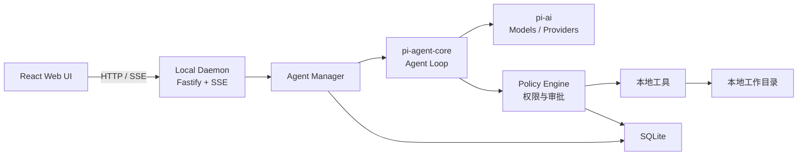
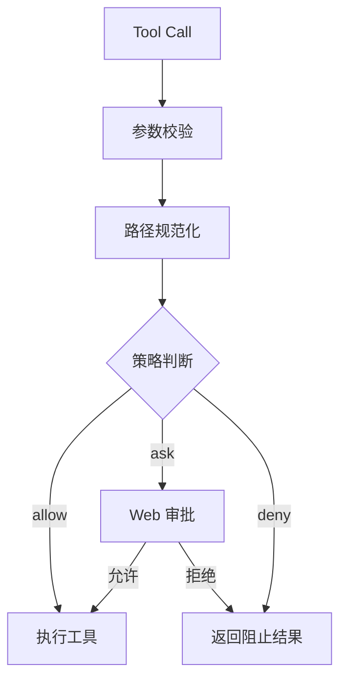

# PI Workbench 项目架构设计

> 纯 Web UI + 本地 daemon + 自研 Harness，底层只使用 `pi-ai` 和 `pi-agent-core`。

不使用：

- `pi-coding-agent`
- Commander
- TUI
- Electron/Tauri
- Pi 内置 Coding Agent Session
- 微服务和云端服务

## 一、最终架构



浏览器只负责页面呈现，不能直接：

- 访问本地文件
- 持有模型密钥
- 执行 Shell
- 调用 Provider
- 管理 Agent 状态

这些全部放在 daemon 中。

## 二、最终技术选型

| 层级 | 技术 |
|---|---|
| 语言 | TypeScript strict + ESM |
| Node | Node.js 24 LTS |
| Monorepo | pnpm workspace |
| Agent loop | `@earendil-works/pi-agent-core` |
| 模型 Provider | `@earendil-works/pi-ai` |
| Daemon API | Fastify |
| 数据校验 | TypeBox |
| 流式输出 | SSE |
| Web | React + Vite |
| 路由 | TanStack Router |
| 请求状态 | TanStack Query |
| 页面状态 | Zustand |
| 样式系统 | Tailwind CSS v4 |
| 基础组件 | HeroUI v3 |
| 业务动画 | Motion |
| 动画组件补充 | Animate UI，按需少量使用 |
| 图标 | Lucide React |
| 可调整面板 | react-resizable-panels |
| 长列表虚拟化 | `@tanstack/react-virtual` |
| 数据库 | SQLite，通过 `node:sqlite` |
| 日志 | pino |
| Shell 执行 | execa |
| 文件监听 | chokidar |
| 文件搜索 | ripgrep 子进程 |
| Diff | 自己记录 edit 前后内容，不依赖 git |

Fastify 和 Pi 都可以围绕 TypeBox 定义参数，工具参数、API DTO 和事件类型能够尽量保持一致。

## 三、项目结构

```text
pi-workbench/
├── apps/
│   ├── daemon/
│   │   └── src/
│   │       ├── config/
│   │       ├── controllers/
│   │       ├── dto/
│   │       ├── server/
│   │       ├── routes/
│   │       ├── services/
│   │       ├── storage/
│   │       ├── sse/
│   │       ├── utils/
│   │       ├── vo/
│   │       └── bootstrap.ts
│   │
│   └── web/
│       └── src/
│           ├── pages/
│           ├── components/
│           ├── features/
│           └── api/
│
├── packages/
│   ├── agent-runtime/
│   │   ├── agent-manager.ts
│   │   ├── agent-factory.ts
│   │   ├── context-builder.ts
│   │   └── event-adapter.ts
│   │
│   ├── providers/
│   │   ├── model-registry.ts
│   │   └── credential-store.ts
│   │
│   ├── tools/
│   │   ├── read-file.ts
│   │   ├── list-files.ts
│   │   ├── search-text.ts
│   │   ├── edit-file.ts
│   │   ├── write-file.ts
│   │   └── run-command.ts
│   │
│   ├── policy/
│   │   ├── path-policy.ts
│   │   ├── command-policy.ts
│   │   └── approval-manager.ts
│   │
│
├── package.json
├── pnpm-workspace.yaml
└── tsconfig.base.json
```

这是一个 Monorepo，但仍然是模块化单体：只有一个 daemon 进程，不拆微服务。
当前配置、SQLite 和 API schema 都保留在实际消费它们的应用内；等出现明确的第二个运行时
消费者后再提取 workspace package。当前不建立 protocol package，Web 只对实际使用的 daemon
响应进行最小校验。

daemon 的 HTTP 调用采用轻量 MVC 分层：`routes` 只声明路径与 schema，`controllers` 处理请求、
Cookie 和重定向，`dto` 定义请求参数，`vo` 定义响应结构，`services` 承担 OAuth 与会话业务
流程，`storage` 负责 SQLite 持久化。只为当前实际职责分层，不为未来功能预建通用抽象。

## 四、Agent Runtime 设计

每个会话对应一个 `Agent`：

```ts
import { Agent } from "@earendil-works/pi-agent-core";
import { createModels } from "@earendil-works/pi-ai";
import { openaiProvider } from "@earendil-works/pi-ai/providers/openai";
import { anthropicProvider } from "@earendil-works/pi-ai/providers/anthropic";

const models = createModels();

models.setProvider(openaiProvider());
models.setProvider(anthropicProvider());

const model = models.getModel("openai", modelId);

const agent = new Agent({
  initialState: {
    systemPrompt,
    model,
    tools,
    messages,
    thinkingLevel: "medium",
  },

  sessionId,
  streamFn: models.streamSimple.bind(models),
  toolExecution: "parallel",

  beforeToolCall: approvalPolicy.beforeToolCall,
  afterToolCall: auditPolicy.afterToolCall,

  transformContext: contextManager.transform,
});
```

`pi-agent-core` 已经提供：

- Stateful Agent
- Tool calling
- 流式事件
- `prompt()`
- `continue()`
- `abort()`
- `steer()`
- `followUp()`
- `beforeToolCall`
- `afterToolCall`
- `transformContext`
- 并行或串行工具执行

因此不需要自己再写 agent loop。[pi-agent-core 文档](https://github.com/earendil-works/pi/blob/main/packages/agent/README.md)

### Agent Manager

daemon 内部维护：

```ts
Map<SessionId, AgentRuntime>
```

每个 `AgentRuntime` 包含：

```ts
interface AgentRuntime {
  agent: Agent;
  sessionId: string;
  workspaceRoot: string;
  activeRunId?: string;
  subscribers: Set<EventSubscriber>;
  lastActiveAt: number;
}
```

规则：

- 一个 session 同时只能运行一个 prompt
- 同一 workspace 同时只允许一个写入型 run
- 不活跃的 Agent 从内存释放
- 再次访问时从 SQLite 恢复 messages
- daemon 关闭前等待活动工具结束或执行 abort

## 五、Provider 设计

`pi-ai` 只运行在 daemon，不打包进 Web。

初期支持：

- OpenAI
- Anthropic
- Google
- OpenRouter
- Ollama/LM Studio 等 OpenAI-compatible API

不要直接使用：

```ts
import { builtinModels } from "@earendil-works/pi-ai/providers/all";
```

推荐按 Provider 注册：

```ts
import { createModels } from "@earendil-works/pi-ai";
import { openaiProvider } from "@earendil-works/pi-ai/providers/openai";
import { anthropicProvider } from "@earendil-works/pi-ai/providers/anthropic";
```

这样 Provider 实现可以按需加载。Pi 官方也建议对包体积敏感的应用按 Provider 导入。[pi-ai Provider 文档](https://github.com/earendil-works/pi/blob/main/packages/ai/README.md#provider-factories)

### 密钥处理

API Key 不能存进浏览器 `localStorage`。

推荐顺序：

1. 环境变量
2. daemon 的 `CredentialStore`
3. 本地权限为 `0600` 的凭据文件
4. 后续接入系统 Keychain

Web 只能获取：

```ts
{
  provider: "openai",
  authenticated: true
}
```

不能读取完整凭据。

虽然 `pi-ai` 支持浏览器运行，但官方也明确警告不要把 API Key 暴露在前端。[pi-ai 浏览器安全说明](https://github.com/earendil-works/pi/blob/main/packages/ai/README.md#browser-usage)

## 六、工具设计

第一版只实现六个工具：

```text
read_file
list_files
search_text
edit_file
write_file
run_command
```

### 工具分类

| 工具 | 默认策略 |
|---|---|
| `read_file` | 自动执行 |
| `list_files` | 自动执行 |
| `search_text` | 自动执行 |
| `edit_file` | 请求审批 |
| `write_file` | 请求审批 |
| `run_command` | 请求审批 |

`edit_file` 第一版使用精确替换：

```ts
{
  path: "src/app.ts",
  oldText: "...",
  newText: "..."
}
```

相比自己解析 unified diff，这种方式更容易检测文件是否已经发生变化。

每次写文件前记录：

```ts
interface FileChange {
  path: string;
  before: string | null;
  after: string;
  runId: string;
  toolCallId: string;
}
```

Web 的 Diff 页面直接使用这份数据，不依赖 git。

### 工具执行模式

只读工具允许并行：

```ts
executionMode: "parallel"
```

写入和 Shell 工具强制串行：

```ts
executionMode: "sequential"
```

`pi-agent-core` 支持全局和单工具执行模式；只要批次中有串行工具，该批次就会串行执行。[工具执行机制](https://github.com/earendil-works/pi/blob/main/packages/agent/README.md#tools)

## 七、权限与审批

`beforeToolCall` 负责判断是否允许执行：



审批钩子可以等待 Web 响应：

```ts
beforeToolCall: async ({ toolCall, args }) => {
  const decision = policy.evaluate(toolCall.name, args);

  if (decision.type === "allow") {
    return;
  }

  if (decision.type === "deny") {
    return {
      block: true,
      reason: decision.reason,
    };
  }

  const approved = await approvalManager.request({
    sessionId,
    toolCall,
    args,
  });

  if (!approved) {
    return {
      block: true,
      reason: "User rejected the operation",
    };
  }
}
```

必须同时在工具内部重新校验路径，避免符号链接或执行期间目录变化绕过检查。

### 路径安全

所有文件工具：

1. 取得 session 的 `workspaceRoot`
2. 将传入路径转为绝对路径
3. 执行 `realpath`
4. 验证目标仍位于 workspace 内
5. 拒绝访问 workspace 外部路径

### Shell 安全

第一版所有 Shell 命令都审批。

另外拒绝：

- 更改 daemon 自身配置目录
- 访问凭据文件
- 修改 workspace 外文件
- 未经批准指定其他 cwd
- 后台常驻进程
- 输出无限增长的命令

## 八、事件协议

daemon 将 Pi 原始事件转成稳定的产品事件：

```ts
interface WorkbenchEvent<T = unknown> {
  id: string;
  seq: number;
  sessionId: string;
  runId?: string;
  timestamp: number;
  type: WorkbenchEventType;
  data: T;
}
```

主要事件：

```ts
type WorkbenchEventType =
  | "run.started"
  | "run.completed"
  | "run.failed"
  | "message.started"
  | "message.delta"
  | "message.completed"
  | "tool.started"
  | "tool.updated"
  | "tool.completed"
  | "tool.failed"
  | "approval.requested"
  | "approval.resolved"
  | "file.changed";
```

Pi 本身会发送 `message_update`、`tool_execution_start`、`tool_execution_update`、`tool_execution_end` 等事件，很适合映射到 SSE。[Agent Event Flow](https://github.com/earendil-works/pi/blob/main/packages/agent/README.md#event-flow)

不要把 Pi 原始事件直接暴露给 Web，否则未来升级 Pi 时前端会被底层 API 绑定。

### 持久化策略

不保存每一个 token delta，只保存：

- 完整 user message
- 完整 assistant message
- tool call 开始和结束
- tool result
- approval
- file change
- run 状态

Token delta 只通过 SSE 实时发送。

## 九、HTTP API

```text
GET    /api/health

GET    /api/auth/github
GET    /api/auth/github/callback
GET    /api/auth/session
POST   /api/auth/logout

GET    /api/workspaces
POST   /api/workspaces/open

GET    /api/providers
GET    /api/models
POST   /api/providers/:id/credentials

GET    /api/sessions
POST   /api/sessions
GET    /api/sessions/:id
DELETE /api/sessions/:id

POST   /api/sessions/:id/prompt
POST   /api/sessions/:id/steer
POST   /api/sessions/:id/follow-up
POST   /api/sessions/:id/abort
GET    /api/sessions/:id/events

POST   /api/approvals/:id/resolve

GET    /api/sessions/:id/changes
GET    /api/files
GET    /api/files/content
```

`events` 使用 SSE。

停止任务直接调用：

```ts
agent.abort();
```

运行中修改方向使用：

```ts
agent.steer(message);
```

追加任务使用：

```ts
agent.followUp(message);
```

这些控制能力已经由 `pi-agent-core` 提供。[Agent Control API](https://github.com/earendil-works/pi/blob/main/packages/agent/README.md#control)

## 十、数据库

建议的数据表：

```text
auth_users
auth_sessions
workspaces
sessions
messages
runs
tool_calls
approvals
file_changes
provider_settings
app_settings
```

GitHub 登录采用 daemon 端 OAuth Web Flow，并使用 `state` 与 PKCE 校验。GitHub access
token 仅用于回调阶段读取并重新验证用户身份，不写入数据库，也不发送给 Web。浏览器只保存
HttpOnly 本地会话 cookie；数据库只保存会话 token 的 SHA-256 摘要。

本地开发时，GitHub OAuth App 的 callback URL 配置为
`http://127.0.0.1:4310/api/auth/github/callback`，并在根目录 `.env` 中设置
`PI_WORKBENCH_GITHUB_CLIENT_ID` 与 `PI_WORKBENCH_GITHUB_CLIENT_SECRET`。daemon 的 dev/start
脚本会读取该文件；需要改变端口或 Web 地址时，同时调整 callback URL 与对应环境变量。
开发脚本会强制将 SQLite 数据写入项目根目录的 `.pi-workbench/workbench.sqlite`，该目录已被
Git 忽略。非 dev 启动仍可通过 `PI_WORKBENCH_DATABASE_PATH` 指定数据位置；未指定时使用用户
目录下的默认位置。

消息主体直接保存 JSON：

```ts
interface StoredMessage {
  id: string;
  sessionId: string;
  sequence: number;
  role: string;
  payload: AgentMessage;
  createdAt: number;
}
```

不要把 assistant content、thinking、tool call 拆成大量关系表，Pi 的消息结构可能继续演进，保存完整 JSON 更稳定。

Agent 恢复过程：

```text
读取 session
→ 读取 messages
→ 查找 provider/model
→ 创建 Agent
→ 注入 system prompt/tools/messages
→ 订阅事件
→ 放入 AgentManager
```

## 十一、上下文管理

因为不使用 `pi-coding-agent`，以下能力需要自己补：

- 加载 `AGENTS.md`
- System Prompt
- Workspace 信息
- 上下文裁剪
- 工具输出截断
- 长会话压缩

System Prompt 建议由四部分组成：

```text
基础身份与行为
+ workspace 约束
+ AGENTS.md
+ 工具使用规则
```

使用 `transformContext` 做：

- 截断过长的 Shell 输出
- 删除已失效的中间 UI 消息
- 保留最近 N 轮完整上下文
- 达到阈值后加入历史摘要

第一版先做裁剪，摘要压缩放到第二阶段。

## 十二、Web 页面

推荐三栏布局：

```text
┌────────────┬──────────────────────────┬─────────────────┐
│ 项目/会话   │ 对话、推理、工具调用      │ 文件变化/审批    │
│            │                          │                 │
│ Sessions   │ Message Timeline         │ Diff            │
│ Projects   │ Composer                 │ Approvals       │
└────────────┴──────────────────────────┴─────────────────┘
```

第一版页面：

- Workspace 选择
- Session 列表
- 对话时间线
- 流式回答
- Tool Call 卡片
- 审批弹窗
- 文件 Diff
- Provider/Model 设置
- Stop/Steer/Follow-up

### UI 与动画标准

HeroUI v3 是项目唯一的基础组件库。Button、Input、Select、Modal、Popover、Tooltip、Tabs、Accordion、Menu 和 Toast 等基础交互组件优先使用 HeroUI，不混用 shadcn/ui、Flowbite、daisyUI 或 Mantine 作为第二套基础组件库。

动画按职责分层：

```text
HeroUI CSS 动画
├── Button 按压与悬停
├── Tooltip / Popover / Menu
├── Modal 进入退出
├── Accordion 展开收起
└── Tabs / Switch / Toast

Motion 业务动画
├── 消息进入
├── 会话切换
├── Tool Call 状态变化
├── 审批卡片出现与退出
├── Diff 面板切换
└── Agent 运行状态与共享布局

Animate UI 少量补充
├── 特殊 Sheet
├── Animated Icon
├── Copy Button
└── HeroUI + Motion 不适合直接实现的个别组件
```

统一使用 Lucide React 图标；三栏工作台和可拖拽区域使用 `react-resizable-panels`；长会话消息与大量事件使用 `@tanstack/react-virtual`。所有动画必须支持 `prefers-reduced-motion`，并优先使用 `transform`、`opacity`，避免动画影响流式输出性能。

不做：

- 完整代码编辑器
- 内嵌终端
- 文件管理 IDE
- 多 Agent
- MCP
- Skill 市场
- 云端协作

## 十三、实施顺序

### 第一阶段：基本对话

- daemon
- React Web
- OpenAI/Anthropic Provider
- Agent 创建和恢复
- SSE 流式消息
- SQLite session
- 停止生成

### 第二阶段：本地操作

- 文件读取
- 文件搜索
- 文件修改
- Shell 执行
- 权限审批
- 文件 Diff
- Tool Call 展示

### 第三阶段：可长期使用

- AGENTS.md
- Provider 凭据管理
- Steering/Follow-up
- 上下文裁剪与压缩
- Workspace 并发锁
- daemon 崩溃恢复
- 审计日志

最终项目定位就是：

> 一个运行在本机的 TypeScript Agent Daemon，通过 `pi-ai` 统一模型，通过 `pi-agent-core` 驱动 Agent Loop，通过 React Web 提供 Codex 风格的交互和审批界面。
